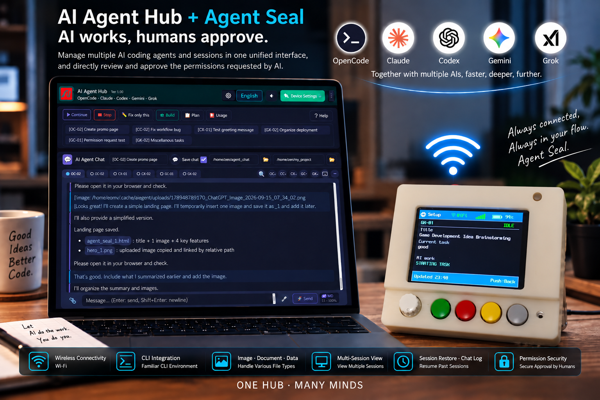

# AI Agent Hub + Agent Seal

> **AI does the work, humans approve.**

`OpenCode` · `Claude` · `Codex` · `Gemini` · `Grok`

Manage multiple AI coding agents and sessions in a single UI,
and review, approve, or deny AI permission requests directly in the UI or on Agent Seal.

## AI Agent Hub

- **Multi AI · Multi Session** — Manage up to 15 sessions across multiple AIs in one UI
- **CLI ↔ UI Sync** — Keep using your familiar CLI while working with the same session in the UI
- **Image · PDF · Text · Data Input** — Send images, PDFs, text, and data directly to AI — including images via simple copy & paste
- **Dual Session View** — Open two active sessions side by side in real time
- **Session Restore · Chat Log** — Reload past sessions and reuse conversation history

## Agent Seal

- **Physical Permission Approval** — Review AI permission requests on the LCD and approve with physical buttons
- **ONCE · ALWAYS · REJECT** — Choose one-time approval, always allow, or rejection
- **Risk Alert** — LED indicators, flashing, and buzzer alerts based on risk level
- **Wireless Network** — Wireless connectivity via Wi-Fi · Bluetooth
- **Real-time Sync** — Keep Hub sessions, AI status, and permission requests synchronized in real time

## Permission Security

- **Default · Security · Enhanced Security**
- Set security policies for each AI — delegate the work to AI while keeping permissions under human control.

---

**ONE HUB · MANY MINDS**

**AI does the work, humans approve.**
