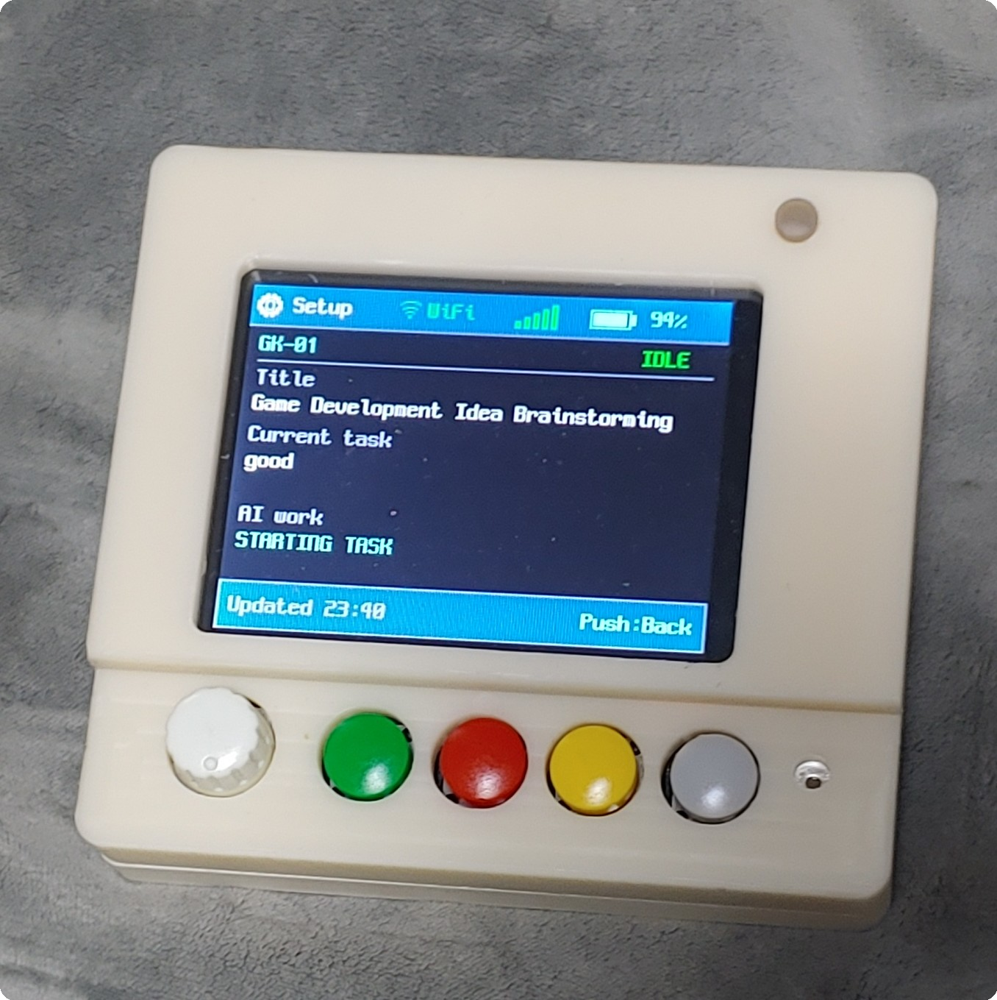

# AI Agent Hub + Agent Seal

> **AI does the work, humans approve.**

`OpenCode` · `Claude` · `Codex` · `Gemini` · `Grok`

Manage multiple AI coding agents and sessions in a single UI,
and review, approve, or deny AI permission requests directly in the UI or on Agent Seal.


## Install on Ubuntu / Debian

The current Linux release supports 64-bit Ubuntu and Debian systems (`amd64`).
The application source code is not included in this distribution.

### Quick install

```bash
curl -fsSL https://raw.githubusercontent.com/sblee1/AgentHub/a3e9f0838359f5084bb4ed27518833cce7da462e/install.sh | sh
```

The installer downloads the official DEB from GitHub Releases, verifies its
SHA-256 checksum, and installs it through APT.

### Manual DEB install

```bash
cd /tmp
curl -fL https://github.com/sblee1/AgentHub/releases/download/v1.0.1/aiagent_1.0.1_amd64.deb -o aiagent_1.0.1_amd64.deb
curl -fL https://github.com/sblee1/AgentHub/releases/download/v1.0.1/SHA256SUMS -o SHA256SUMS
grep ' aiagent_1.0.1_amd64.deb$' SHA256SUMS | sha256sum -c -
chmod 0644 aiagent_1.0.1_amd64.deb
sudo apt install ./aiagent_1.0.1_amd64.deb
```

### Standalone binary

The standalone executable contains the complete web UI and does not require a
separate `index.html`, CSS, JavaScript, or asset directory.

```bash
curl -fLO https://github.com/sblee1/AgentHub/releases/download/v1.0.1/aiAgent_1.0.1_linux_amd64
curl -fLO https://github.com/sblee1/AgentHub/releases/download/v1.0.1/SHA256SUMS
grep ' aiAgent_1.0.1_linux_amd64$' SHA256SUMS | sha256sum -c -
chmod +x aiAgent_1.0.1_linux_amd64
./aiAgent_1.0.1_linux_amd64
```

Launch **AI Agent Hub** from the application menu or run:

```bash
aiAgent
```

To remove it:

```bash
sudo apt remove aiagent
```

Chrome or Chromium and the desktop integration dependencies are installed or
resolved by APT. Install and sign in to whichever supported AI CLI services you
want to use. Agent Seal hardware is optional.

## AI Agent Hub

- **Multi AI · Multi Session** — Manage up to 15 sessions across multiple AIs in one UI
- **CLI ↔ UI Sync** — Keep using your familiar CLI while working with the same session in the UI
- **Image · PDF · Text · Data Input** — Send images, PDFs, text, and data directly to AI — including images via simple copy & paste
- **Dual Session View** — Open two active sessions side by side in real time
- **Session Restore · Chat Log** — Reload past sessions and reuse conversation history

## Agent Seal

<p align="center">
  
</p>

- **Physical Permission Approval** — Review AI permission requests on the LCD and approve with physical buttons
- **ONCE · ALWAYS · REJECT** — Choose one-time approval, always allow, or rejection
- **Risk Alert** — LED indicators, flashing, and buzzer alerts based on risk level
- **Voice Input** — Use the built-in microphone to give instructions to AI agents and fill in responses by voice
- **Wireless Network** — Wireless connectivity via Wi-Fi · Bluetooth
- **Real-time Sync** — Keep Hub sessions, AI status, and permission requests synchronized in real time
- **Compact Size** — Just 94 × 86 × 24 mm (W × D × H)
- **Battery Life** — Up to 20 hours of typical use
- **USB-C Charging** — Recharge via USB-C

## Permission Security

- **Default · Security · Enhanced Security**
- Set security policies for each AI — delegate the work to AI while keeping permissions under human control.

---

**ONE HUB · MANY MINDS**

**AI does the work, humans approve.**
